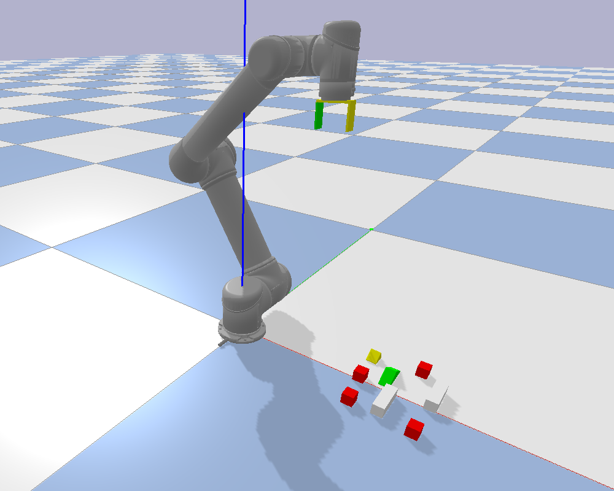

# Action Priors for Large Action Spaces in Robotics

This repository contains the source code for [Action Priors for Large Action Spaces in Robotics](https://arxiv.org/abs/2101.04178).
Our implementation us PyTorch for neural nets and PyBullet for robotic simulation



## Setup Python

Set up a Python 3.6 virtual environment.
```
env_path=~/ap_env
python3 -m venv $env_path
source ${env_path}/bin/activate
```

Installed required packages.

```
pip install -r requirements.txt
```

Install [pytorch and torchvision](https://pytorch.org/). I used torch==1.5.1 and torchvision==0.6.1 but you should make sure that 
the version of pytorch you are using matches your CUDA and cuDNN versions.
Fruits World models might be trainable on a CPU, but if you want to replicate our block stacking experiments
you will need to use a GPU.

## (Optional) Setup MongoDB

We use [sacred](https://github.com/IDSIA/sacred) with MongoDB backend to store the results of our experiments.
You can either set up MongoDB or run our scripts without it. If you decide on the latter our scripts will print
the results in the terminal, but you will not be able to generate aggregated results 
(e.g. running action priors and DQNs ten times and comparing their mean rewards).

Install MongoDB: general [guide](https://docs.mongodb.com/manual/installation/) (Ubuntu-specific [guide](https://docs.mongodb.com/manual/tutorial/install-mongodb-on-ubuntu/)).

Start MongoDB (you should run this inside of a screen so that the DB keeps running when you exit command line).

```
mkdir -p data/mongo_db
cd data/mongo_db
mongod --dbpath .
```

Create a database.

```
mongo                           # connect mongodb client
use experiments                 # use experiments DB
db.test.insert({test: "test"})  # add a single entry in order to create DB
```

Open ap/constants.py and change the last two lines from
```
MONGO_URI = None
DB_NAME = None
```
to
```
MONGO_URI = "mongodb://localhost"
DB_NAME = "experiments"
```

## Replicating Fruits World Experiments

### Running Experiments

There are versions of the experiment: picking up fruits in any order (ap/envs/fruits.py)
and picking up fruits in a specific order (ap/envs/fruits_seq.py). We instantiate 30 tasks in the former
and 20 in the latter. You can find lists of tasks in ap/cfg/tasks.

Train an expert DQN for each task individually:
```
python -m ap.sh.fruits_comb.fruits_DQN_models

python -m ap.sh.fruits_seq.fruits_seq_DQN_models
```

Collection and join datasets (used to train action priors):

```
python -m ap.sh.fruits_comb.fruits_DQN_models_collect_data
python -m ap.sh.fruits_comb.fruits_DQN_join_datasets_limit

python -m ap.sh.fruits_seq.fruits_seq_DQN_models_collect_data
python -m ap.sh.fruits_seq.fruits_seq_DQN_join_datasets_limit
```

Train action priors. We will get as many action prior networks as there are tasks.
For example, data/fruits_seq_AAF_cv/model_5.pt is an action prior that was trained
on all tasks **except** for the 5th one. In our leave-one-out experiment, we train
an action prior (or Actor-Mimic) on N-1 tasks, and then use it to learn
a previously unseen Nth task.

```
python -m ap.sh.fruits_comb.fruits_AAF_cv

python -m ap.sh.fruits_seq.fruits_seq_AAF_cv
```

Train Actor-Mimic students (baseline). Same logic as above.

```
python -m ap.sh.fruits_comb.actor_mimic_v2

python -m ap.sh.fruits_seq.seq_actor_mimic_v2
```

Perform transfer learning with action priors. The transfer script will repeat each experiment
ten times. You can edit them if you want less runs.

```
python -m ap.sh.fruits_comb.fruits_DQN_AAF

python -m ap.sh.fruits_seq.fruits_seq_DQN_AAF
```

Get results for baselines:

```
python -m ap.sh.fruits_comb.fruits_DQN_baselines    # no transfer DQN
python -m ap.sh.fruits_comb.fruits_DQN_transfer     # various actor-mimic alternatives
python -m ap.sh.fruits_comb.fruits_DQN_freeze_transfer
python -m ap.sh.fruits_comb.fruits_DQN_side_transfer

python -m ap.sh.fruits_seq.fruits_seq_DQN_baselines    # no transfer DQN
python -m ap.sh.fruits_seq.fruits_seq_DQN_transfer     # various actor-mimic alternatives
python -m ap.sh.fruits_seq.fruits_seq_DQN_freeze_transfer
python -m ap.sh.fruits_seq.fruits_seq_DQN_side_transfer
```

### Analyzing Results

Recreate Figure 2. This script will first show a figure for fruits combinations
and then fruits sequences.

```
python -m ap.scr.analyze.fruits_figure
```

Recreate Table 3 in the appendix.

* fruits_DQN_AAF: action priors transfer
* fruits_DQN_baselines: no transfer
* other: actor-mimic transfer, see description in the paper

Num. fruits refer to the difficulty of the task. Mid/fin point/window refer
to the performance in the middle or at the end of training. Mid window is
averaged over a small window of training steps.

```
python -m ap.scr.analyze.fruits_comb_table

python -m ap.scr.analyze.fruits_seq_table
```

## Replicating Block Stacking Experiments

### Selecting GPUs and Parallelization

Scripts for running simulated block stacking in pybullet can be found in ap/sh/blocks.
Each script has at least two arguments:
* --gpu-list: list of GPUs to use (e.g. --gpu-list 0 1)
* --jobs-per-gpu: number of jobs to run on each GPU (e.g. --jobs-per-gpu 2)

These arguments control the parallelization over the 16 different tasks we have.
For example
```
python -m ap.sh.blocks.blocks_sdqfd_c --gpu-list 0 1 --jobs-per-gpu 2
```
will train 16 different SDQfD agents (one for each task). It will train two agents in parallel
on the first GPU and two agents in parallel on the second GPU resulting in four agents
being trained at the same time.

To generate the results in our paper, we used a machine with four NVIDIA RTX 2080 Ti GPUs, 256 GB of RAM and
an AMD Rizen Threadripper CPU. Each experiment took about two days when we ran two agents on each GPU
(i.e. eight agents trained in parallel). SDQfD training takes about one day, and collecting deconstruction
episodes takes a couple of hours.

You can reduce the training time by training on fewer tasks. Simply delete some tasks
from ap/cfg/tasks/block_stacking.json.

### Running Experiments

Collect deconstruction episodes. It's around 50 GB of data for 16 tasks.
```
python -m ap.sh.blocks.blocks_collect_dec_c
```
Train SDQfD experts on each task:
```
python -m ap.sh.blocks.blocks_sdqfd_c
```
Collect training data for action priors using experts.
While running, these scripts might need up to 200 GB of storage for 
intermediate files (we are storing a bunch of uncompressed images and binary maps).
However, the final dataset size is going to be much smaller.
```
python -m ap.sh.blocks.blocks_sdqfd_c_collect
python -m ap.sh.blocks.blocks_sdqfd_c_add_labels
python -m ap.sh.blocks.blocks_sdqfd_c_join_labels
```
Train action priors:
```
python -m ap.sh.blocks.blocks_aaf_c_cv
```
Perform transfer learning with action priors and baselines:
```
python -m ap.sh.blocks.blocks_DQN_AAF   # action prior exploration
python -m ap.sh.blocks.blocks_DQN_HS    # heuristic exploration
python -m ap.sh.blocks.blocks_DQN_RS    # random exploration
```
### Analyzing Results

Print final per-task performance for action priors exploration (blocks_DQN_AAF),
heuristic exploration (blocks_DQN_HS) and random exploration (blocks_DQN_RS).

```
python -m ap.scr.analyze.blocks_table
```

## Contributors

* [Ondrej Biza](https://sites.google.com/view/obiza) and [Dian Wang](https://www.khoury.northeastern.edu/people/dian-wang/): action priors.
* [Colin Kohler](https://www.khoury.northeastern.edu/people/colin-kohler/), [Dian Wang](https://www.khoury.northeastern.edu/people/dian-wang/) and [Ondrej Biza](https://sites.google.com/view/obiza): pybullet simulated block stacking (ap/helping_hands_rl_envs).

## Citation

```
@inproceedings{biza21action,
    title={Action Priors for Large Action Spaces in Robotics}, 
    author={Ondrej Biza and Dian Wang and Robert Platt and Jan-Willem van de Meent and Lawson L. S. Wong},
    year = {2021},
    publisher = {International Foundation for Autonomous Agents and Multiagent Systems},
    address = {Richland, SC},
    booktitle = {Proceedings of the 20th International Conference on Autonomous Agents and MultiAgent Systems},
    location = {Online},
    series = {AAMAS '21}
}
```